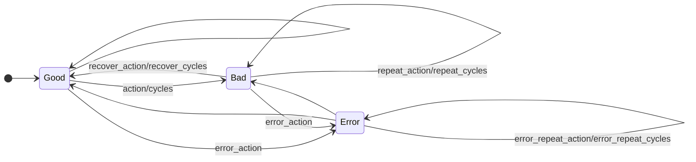
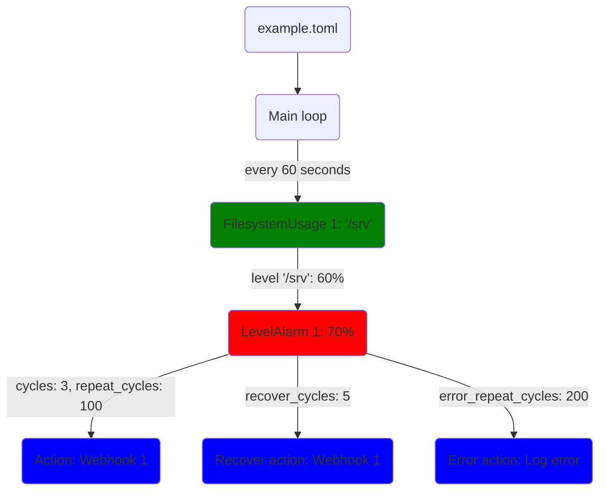

# MinMon - an opinionated minimal monitoring and alarming tool (for Linux)
This tool is just a single binary and a config file. No database, no GUI, no graphs. Just monitoring and alarms.
I wrote this because the [existing alternatives](./doc/existing-alternatives.md) I could find were too heavy, mainly focused on nice GUIs with graphs (not on alarming), too complex to setup, or targeted at cloud/multi-instance setups.

[](https://github.com/flo-at/minmon/actions/workflows/test.yml)
[](https://github.com/flo-at/minmon/pkgs/container/minmon)
[](https://github.com/flo-at/minmon/actions/workflows/cargo-deny.yml)
[](https://deps.rs/repo/github/flo-at/minmon)\
[](https://github.com/flo-at/minmon/releases)
[](https://crates.io/crates/minmon)
[](https://aur.archlinux.org/packages/minmon)
[](./LICENSE)

# Checks
The [checks](./doc/check.md) read the measurement values that will be monitored by MinMon.

- [FilesystemUsage](./doc/check/filesystem_usage.md)
- [MemoryUsage](./doc/check/memory_usage.md)
- [NetworkThroughput](./doc/check/network_throughput.md)
- [PressureAverage](./doc/check/pressure_average.md)
- [ProcessExitStatus](./doc/check/process_exit_status.md)
- [SystemdUnitStatus](./doc/check/systemd_unit_status.md)
- [Temperature](./doc/check/temperature.md)

# Actions
An [action](./doc/action.md) is triggered, when a check's alarm changes its state or a report event is triggered.

- [Email](./doc/action/email.md)
- [Log](./doc/action/log.md)
- [Process](./doc/action/process.md)
- [Webhook](./doc/action/webhook.md)

# Report
The absence of alarms can mean two things: everything is okay or the monitoring/alarming failed altogether.
That's why MinMon can trigger regular [report](./doc/report.md) events to let you know that it's up and running.

# Design decisions
- No complex scripting language.
- No fancy config directory structure - just a single TOML file.
- No users, groups or roles.
- No cryptic abbreviations. The few extra letters in the config file won't hurt anyone.
- There are no predefined threshold names like "Warning" or "Critical". You might might want more than just two, or only one. So that's up to you to define in the config.
- The same check plugin can be used multiple times. You might want different levels to trigger different actions for different filesystems at different intervals.
- Alarms are timed in "cycles" (i.e. multiples of the `interval` of the check) instead of seconds. It's not very user-friendly but helps to keep the internal processing and the code simple and efficient.
- Alarms stand for themselves - they are not related. This means that depending on your configuration, two (or more) events may be triggered at the same time for the same check. There are cases where this could be undesirable.
- Simple, clean, bloat-free code with good test coverage.
- Depending on your configuration, there may be similar or identical blocks in the config file. This is a consequence of the flexibility and simpleness of the config file format.
- All times and dates are UTC. No fiddling with local times and time zones.
- No internal state is stored between restarts.
- As of now it's only for Linux but it should be easy to adapt to other *NIXes or maybe even Windows.
- Some of the things mentioned above may change in the future (see [Roadmap](#roadmap)).

# Config file
The config file uses the [TOML](https://toml.io) format and has the following sections:
- [log](./doc/log.md)
- [report](./doc/report.md)
- [actions](./doc/action.md)
- [checks](./doc/check.md)

# Architecture
## System overview


## Alarm state machine
Each alarm has 3 possible states. "Good", "Bad" and "Error".\
It takes `cycles` consecutive bad data points to trigger the transition from "Good" to "Bad" and `recover_cycles` good ones to go back. These transitions trigger the `action` and `recover_action` actions.
During the "Bad" state, `action` will be triggered again every `repeat_cycles` cycles (if `repeat_cycles` is not 0).\
\
The "Error" state is a bit special as it only "shadows" the other states.
An error means that there is no data available at all, e.g. the filesystem usage for `/home` could not be determined.
Since this should rarely ever happen, the transition to the error state always triggers the `error_action` on the first cycle. If there is valid data on the next cycle, the state machine continues as if the error state did not exist.



# Example
Check the mountpoint at `/home` every minute. If the usage level exceeds 70% for 3 consecutive cycles (i.e. 3 minutes), the "Warning" alarm triggers the "Webhook 1" action. The action repeats every 100 cycles until the "Warning" alarm recovers. This happens after 5 consecutive cycles below 70% which also triggers the "Webhook 1" action. If there is an error while checking the filesystem usage, the "Log error" action is triggered. This is repeated every 200 cycles.

## Config
```toml
[[checks]]
interval = 60
name = "Filesystem usage"
type = "FilesystemUsage"
mountpoints = ["/home"]

[[checks.alarms]]
name = "Warning"
level = 70
cycles = 3
repeat_cycles = 100
action = "Webhook 1"
recover_cycles = 5
recover_action = "Webhook 1"
error_repeat_cycles = 200
error_action = "Log error"

[[actions]]
name = "Webhook 1"
type = "Webhook"
url = "https://example.com/hook1"
body = """{"text": "{{check_name}}: Alarm '{{alarm_name}}' for mountpoint '{{check_id}}' changed state to *{{alarm_state}}* at {{level}}."}"""
headers = {"Content-Type" = "application/json"}

[[actions]]
name = "Log error"
type = "Log"
level = "Error"
template = """{{check_name}} check didn't have valid data for alarm '{{alarm_name}}' and id '{{alarm_id}}': {{check_error}}."""
```

The webhook text will be rendered into something like "Warning: Filesystem usage on mountpoint '/home' reached 70%."

## Diagram


## Some (more exotic) ideas
Just to give some ideas of what's possible:
- Run it locally on your workstation and let it send you notifications to your desktop environment using the Process action and `notify-send` when the filesystem fills up.
- Use the report in combination with the Webhook action and [telepush](https://telepush.dev) and let it send you "I'm still alive, since {{minmon_uptime_iso}}!" once a week to your Telegram messenger for the peace of mind.

# Placeholders
To improve the reusability of the actions, it's possible to define custom placeholders for the report, events, checks, alarms and actions.
When an action is triggered, the placeholders (generic and custom) are merged into the final placeholder map.
Inside the action (depending on the type of the action) the placeholders can be used in one or more config fields using the `{{placeholder_name}}` syntax.
There are also some [generic placeholders](./doc/placeholders.md) that are always available.
Placeholders that don't have a value available when the action is triggered will be replaced by an empty string.

# Installation
## Docker image
To pull the docker image use
```sh
docker pull ghcr.io/flo-at/minmon:latest
```
or the example [docker-compose.yml](docker-compose.yml) file.\
In both cases, read-only mount your config file to `/etc/minmon.toml`.

## Build and install using cargo
Make sure cargo and OpenSSL are correctly installed on your local machine.\
You can either install MinMon from crates.io using
```sh
cargo install --all-features minmon
```
Or if you already checked out the repository, you can build and install your local copy like this:
```sh
cargo install --all-features --path .
```
Copy the `systemd.minmon.service` file to `/etc/systemd/system/minmon.service` and place your config file at path `/etc/minmon.toml`.
You can enable and start the service with `systemctl daemon-reload && systemctl enable --now minmon.service`.\
\

## Install for the AUR (Arch Linux)
Use your package manager of choice to install the [minmon](https://aur.archlinux.org/packages/minmon) package from the AUR.\
Place your config file at path `/etc/minmon.toml`.
You can enable and start the service with `systemctl daemon-reload && systemctl enable --now minmon.service`.\

# systemd integration (optional)
Build with `--features systemd` to enable support for systemd.

- Logging to journal.
- Notify systemd about start-up completion (`Type=notify`).
- Periodically reset systemd watchdog (`WatchdogSec=x`).

# lm_sensors integration (optional)
Build with `--features sensors` to enable support for lm_sensors.\
For the docker image, optionally mount your lm_sensors config file(s) to `/etc/sensors.d/`.\
Note: libsensors is not cooperative and might theoretically block the event loop.

# Contributions
Contributions are very welcome! MinMon is pretty easy to extend. Even if it's just a typo in the documentation, I'll be happy to merge your PR.
If you have an idea for a new check or action please use use the [discussions](https://github.com/flo-at/minmon/discussions) page instead of opening a new issue.
