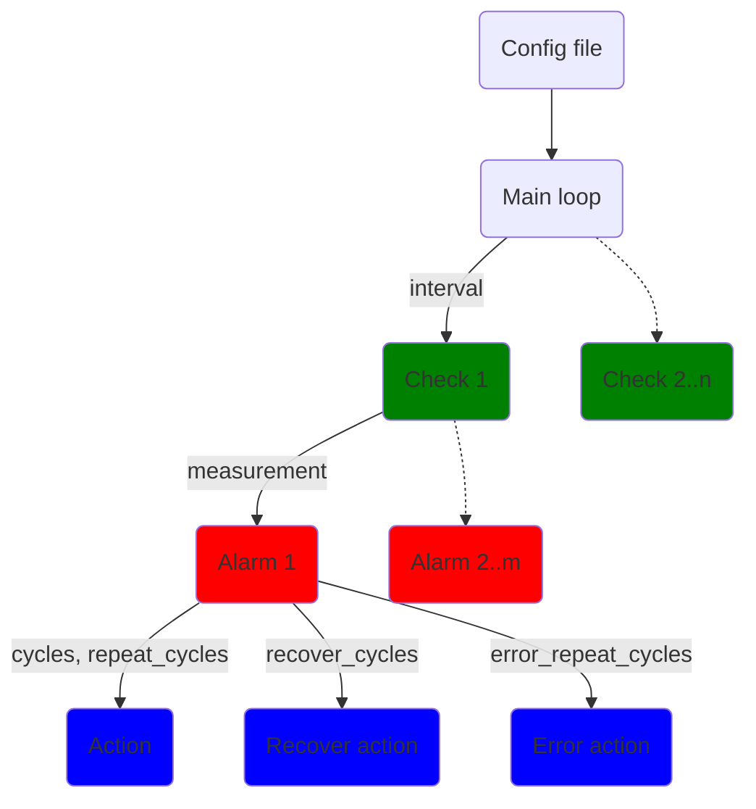
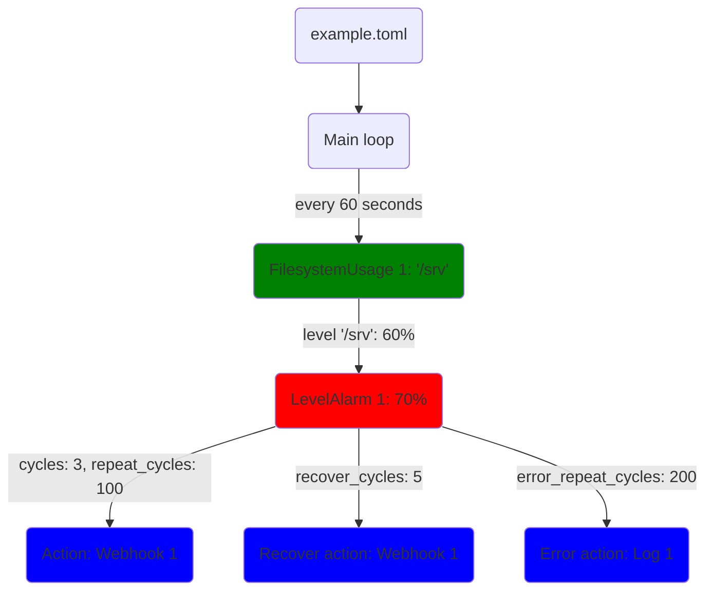

# MinMon - an opinionated minimal monitoring and alarming tool (for Linux)
This tool is just a single binary and a config file. No database, no GUI, no graphs. Just monitoring and alarms.
I wrote this because the [exsiting alternatives](./doc/existing-alternatives.md) I could find were too heavy, mainly focused on nice GUIs with graphs (not on alarming), too complex to setup or targeted at cloud/multi-instance setups.

[](https://github.com/flo-at/minmon/actions/workflows/test.yml)
[](https://github.com/flo-at/minmon/pkgs/container/minmon)
[](https://github.com/flo-at/minmon/actions/workflows/cargo-publish.yml)
[](https://github.com/flo-at/minmon/actions/workflows/cargo-deny.yml)
[](https://crates.io/crates/minmon)
[](./LICENSE)
[](https://github.com/flo-at/minmon/tags)

# Checks
- [Filesystem usage](./doc/check.md#filesystemusage)
- [Memory usage](./doc/check.md#memoryusage)

# Actions
- [Log](./doc/action.md#log)
- [Process](./doc/action.md#process)
- [Webhook](./doc/action.md#webhook)

# Report
The absence of alarms can mean two things: everything is okay or the monitoring/alarming failed.
That's why MinMon can trigger regular report actions to let you know that it's up and running.

# systemd integration (optional)
- Logging to journal.
- Notify systemd about start-up completion (`Type=notify`).
- Periodically reset systemd watchdog (`WatchdogSec=x`).

# Design decisions
- No complex scripting language.
- No fancy config directory structure - just a single TOML file.
- No cryptic abbreviations. The few extra letters in the config file won't hurt anyone.
- There are no predefined threshold names like "Warning" or "Critical". You might might want more than just two, or only one. So that's up to you to define in the config.
- The same check plugin can be used multiple times. You might want different levels to trigger different actions for different filesystems/storages/..
- Alarms are timed in "cycles" (i.e. multiples of the `interval` of the check) instead of seconds. It's not very user-friendly but helps keep the internal processing simple and efficient.
- Alarms stand for themselves - they are not related. This means that depending on your configuration, two (or more) events may be triggered at the same time for the same check. There are cases where this is not desired.
- Simple, clean, bloat-free code with good test coverage.
- Depending on your configuration, there may be similar or identical blocks in the config file. This is a consequence of the flexibility and simpleness of the config file format (and thus the code).
- All times and dates are UTC. No fiddling with local times and time zones.
- No internal state is stored between restarts.
- As of now it's only for Linux but it should be easy to adapt to other *NIXes or Windows.
- Some of the things mentioned above may change in the future (see [Roadmap](#roadmap))

# Installation
## Docker image
To pull the docker image use
```sh
docker pull ghcr.io/flo-at/minmon:latest
```
or the example [docker-compose.yml](docker-compose.yml) file.

## Build and install using cargo
Make sure cargo is correctly installed on your local machine.
You can either install MinMon from crates.io using
```sh
cargo install --all-features minmon
```
Or if you already checked out the repository, you can build and install your local copy like this:
```sh
cargo install --all-features --path .
```
If you don't want to include the systemd integration, leave away the `--all-features` option.

# Architecture
## Diagram


# Example
## Config
```toml
[[checks]]
interval = 60
name = "FilesystemUsage 1"
type = "FilesystemUsage"
mountpoints = ["/srv"]
#placeholders = {}

[[checks.alarms]]
name = "LevelAlarm 1"
level = 70
cycles = 3
repeat_cycles = 100
action = "Webhook 1"
recover_cycles = 5
recover_action = "Webhook 1"
error_repeat_cycles = 200
error_action = "Log 1"
placeholders = {"level_name" = "Warning"}

[[actions]]
name = "Webhook 1"
type = "Webhook"
url = "https://example.com/hook1"
method = "POST"
timeout = 5
body = """{"text": "Generic: {{check_name}}, {{alarm_name}}, {{alarm_level}}, {{alarm_timestamp}}, {{action_name}}. Custom: {{level_name}}"}"""
headers = {"Content-Type" = "application/json"}
#placeholders = {}

[[actions]]
name = "Log 1"
type = "Log"
template = """Generic: {{check_name}}, {{check_error}}, {{alarm_name}}, {{alarm_uuid}}, {{alarm_timestamp}}, {{action_name}}. Custom: {{level_name}}"""
level="Error"
```
## Diagram


## Placeholders
To improve the reusability of the actions, it's possible to define custom placeholders for checks, alarms and actions.
With this you can - for example - define custom alarm level names as shown in the example.
When an action is triggered, the placeholders (generic and custom) of the check, the alarm and the action are merged into the final placeholder map.
Inside the action (depending on the type of the action) the placeholders can be used in one or more config fields using the `{{placeholder_name}}` syntax.

### Generic placeholders
- `check_name`
- `alarm_name`
- `alarm_uuid`
- `alarm_timestamp`
- `action_name`

# Roadmap
## Action ideas
- E-mail

## Check ideas
- Filesystem inode usage
- Folder size
- S.M.A.R.T.
- Load
- Temperatures
- Ping
- HTTP response, keyword, ..
- systemd service status
- Docker/Podman container status

## General ideas
- Store measurements/status in time-based database (e.g. rrdtool) and visualize on Webinterface or ncurses UI. This should be optional and separated from the existing code.
