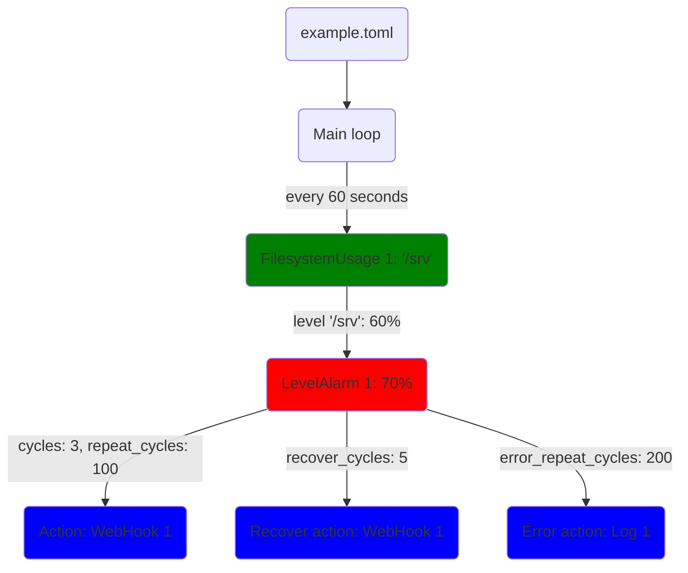

# MinMon - an opinionated minimal monitoring and alarming tool
This tool is just a single binary and a config file. No database, no GUI, no graphs, no runtime dependencies. Just monitoring and alarms.
I wrote this because the [exsiting alternatives](#existing-alternatives) I could find were too heavy, mainly focused on nice GUIs with graphs (not on alarming), too complex to setup or targeted at cloud/multi-instance setups.

# Checks
- Filesystem usage
- Memory

# Actions
- WebHook
- Log

# Report
The absence of alarms can mean two things: everything is okay or the monitoring/alarming failed.
That's why MinMon can trigger regular report actions to let you know that it's up and running.

# Systemd integration (optional)
- Logging to journal.
- Notify systemd about start-up completion (`Type=notify`).
- Periodically reset systemd watchdog (`WatchdogSec=x`).

# Design decisions
- No complex scripting language.
- No fancy config directory structure - just a single TOML file.
- No cryptic abbreviations. The few extra letters in the config file won't hurt anyone.
- There are no predefined threshold names like "Warning" or "Critical". You might might want more than just two, or only one. So that's up to you to define in the config.
- The same check plugin can be used multiple times. You might want different levels to trigger different actions for different filesystems/storages/.. (TODO try to batch queries to reduce monitoring load)
- Alarms are timed in "cycles" (i.e. multiples of the `interval` of the check) instead of seconds. It's not very user-friendly but helps keep the internal processing simple and efficient.
- Alarms stand for themselves - they are not related. This means that depending on your configuration, two (or more) events may be triggered at the same time for the same check. There are cases where this is not desired.
- Simple, clean, bloat-free code.
- Depending on your configuration, there might be similar or identical blocks in the config file. This is a consequence of the flexibility and simpleness of the config file format (and thus the code).
- All times and dates are UTC. No fiddling with local times and time zones.
- MinMon does not store it's internal state between restarts.

# Architecture
## Diagram


# Example
## Config
```toml
[[checks]]
interval = 60
name = "FilesystemUsage 1"
type = "FilesystemUsage"
mountpoints = ["/srv"]
#placeholders = {}

[[checks.alarms]]
name = "LevelAlarm 1"
level = 70
cycles = 3
repeat_cycles = 100
action = "WebHook 1"
recover_cycles = 5
recover_action = "WebHook 1"
error_repeat_cycles = 200
error_action = "Log 1"
placeholders = {"level_name" = "Warning"}

[[actions]]
name = "WebHook 1"
type = "WebHook"
url = "https://example.com/hook1"
method = "POST"
timeout = 5
body = """{"text": "Generic: {{check_name}}, {{alarm_name}}, {{alarm_level}}, {{alarm_timestamp}}, {{action_name}}. Custom: {{level_name}}"}"""
headers = {"Content-Type" = "application/json"}
#placeholders = {}

[[actions]]
name = "Log 1"
type = "Log"
template = """Generic: {{check_name}}, {{check_error}}, {{alarm_name}}, {{alarm_uuid}}, {{alarm_timestamp}}, {{action_name}}. Custom: {{level_name}}"""
level="Error"
```
## Diagram


## Placeholders
To improve the reusability of the actions, it's possible to define custom placeholders for checks, alarms and actions.
With this you - for example - can define custom alarm level names as shown in the example.
When an action is triggered, the placeholders (generic and custom) of the check, the alarm and the action are merged into the final placeholder map.
Inside the action (depending on the type of the action) the placeholders can be used in one or more config fields using the `{{placeholder_name}}` syntax.

# Roadmap
## Action ideas
- E-mail

## Check ideas
- Filesystem inode usage
- Folder size
- S.M.A.R.T.
- Load
- Temperatures
- Ping
- HTTP response, keyword, ..

## General ideas
- Store measurements/status in time-based database (e.g. rrdtool) and visualize on Webinterface or ncurses UI. This should be optional and separated from the existing code.

# Existing alternatives

## [Glances](https://nicolargo.github.io/glances/)
Closest to what I wanted but:
- Repeated alarms are sent on every check. There is no configuration option to change that.
- There is no action to trigger on recovery.
- [Actions are not triggered in server mode](https://github.com/nicolargo/glances/issues/1879). That's the deal-breaker for my use-case.

## [Netdata](https://www.netdata.cloud/)
- It's "all in one" and easy enough to get it started. Still quite a big tool for such a small task.

## [Monit](https://mmonit.com/monit/)
- Only e-mail alarms.
- Can also run scripts on alarm events but it's not very flexible.
- There's [monit2telegram](https://github.com/matriphe/monit2telegram) to enable basic Telegram notifications.
- Pretty complex config file with it's own scripting language.

## Others
There are numerous options such as InnoDB/Telegraf, Prometheus, and many more with tons of features and complex configuration that seem overkill for single-instance monitoring/alarming.
